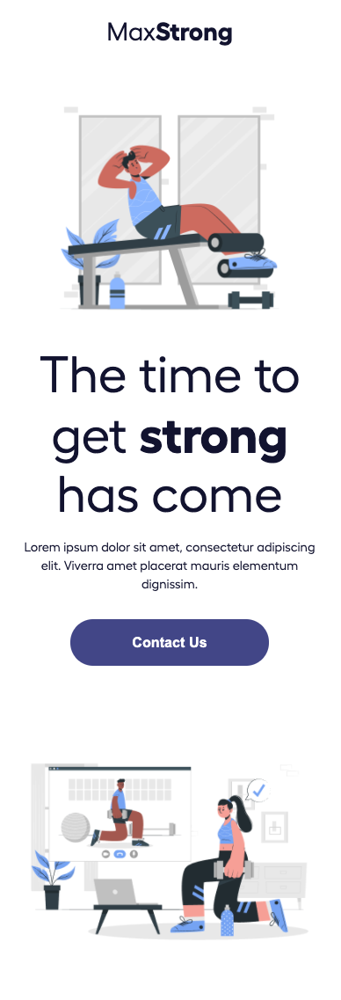
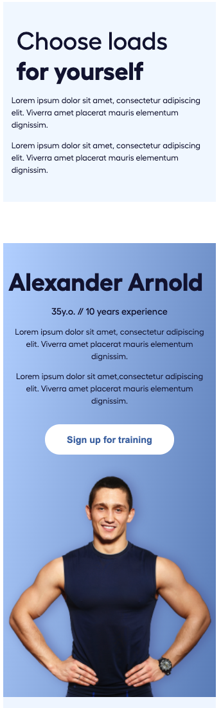
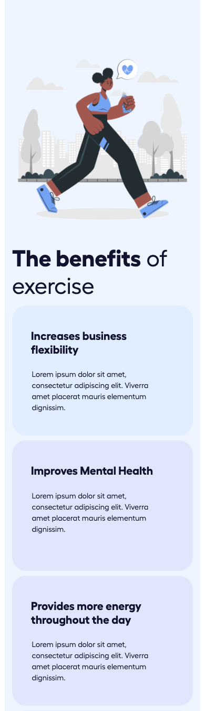
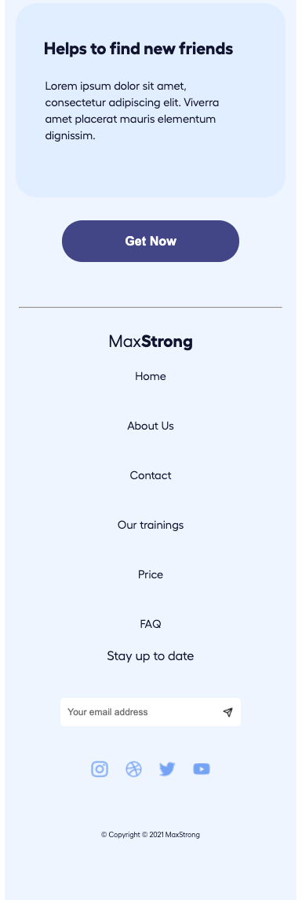
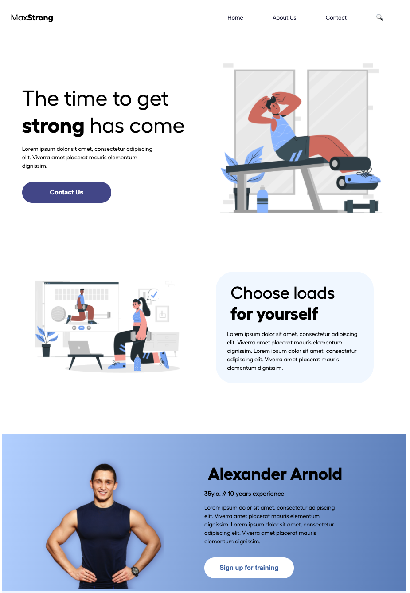
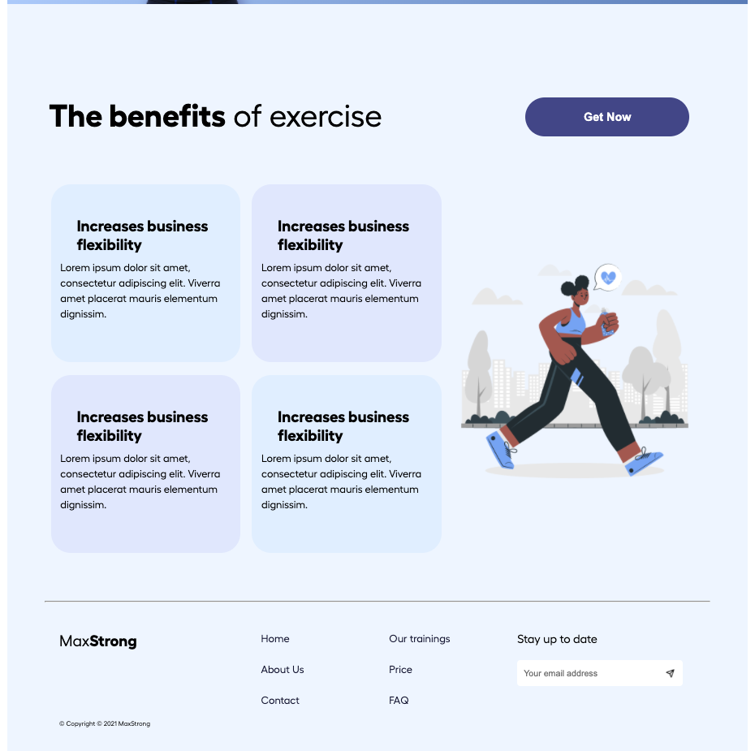

# max-strong-landing-page

To visit this site please visit: https://max-strong.herokuapp.com/

This site was designed using the "Mobile-First" approach.

I only set a single breakpoint at 992px.
  

## Mobile View Top

### Single column with no navigation at the top.

  

## Mobile View Middle Top

  

## Mobile View Middle Bottom

  

## Mobile View Bottom

  

## Desktop View Top

### Uses Flex Containers for Responsive Page

  

## Desktop View Bottom

  
